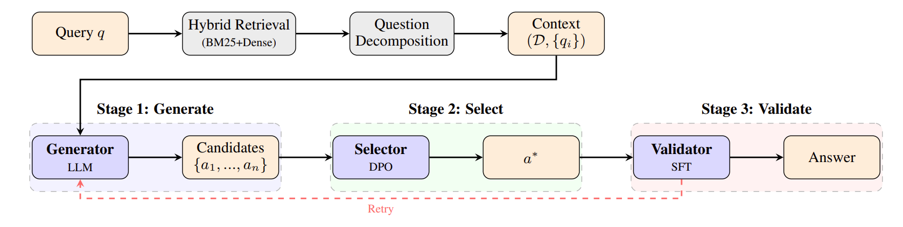
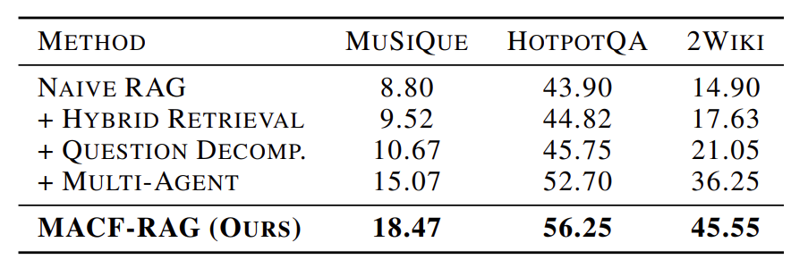
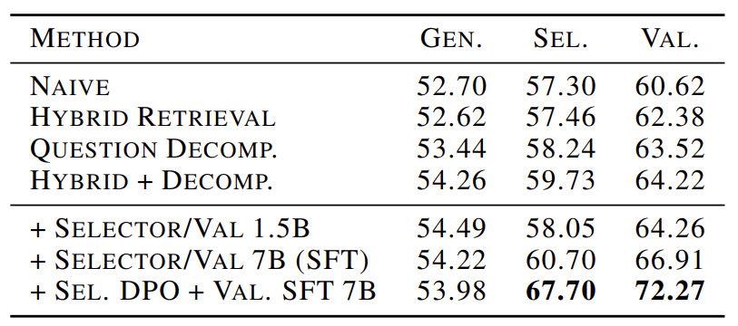
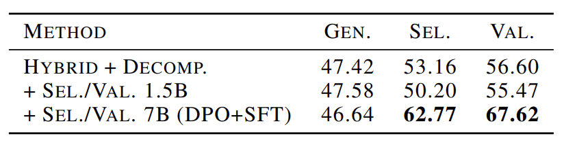

# MACF-RAG
> a novel framework that addresses hallucination through a three-stage pipeline: Generate, Select, and Validate. Our approach employs specialized agents at each stage, with the selector trained via Direct Preference Optimization (DPO) and the validator fine-tuned with supervised learning to ensure factual consistency. 



---
## Install

```bash
# remember clone this repo first
cd MACF-RAG
pip install -r requirements.txt
```
## Data Process
The input file data/qa_and_corpus.json should be a list of objects with the following format:
```json
[
  {
    "question": "What is RAG?",
    "answer": "Retrieval-Augmented Generation...",
    "context": [["Introduction", ["RAG combines retrieval...", "..."]]]
  }
]
```

### Step 1: 
split data into qa.json and corpus.json
```python
input_file = "data/qa&corpus.json"
qa_output = "data/qa.json"
corpus_output = "data/corpus.json"
seen_texts = set()
corpus_list = []
qa_list = []
with open(input_file, 'r', encoding='utf-8') as fin:
    data_list = json.load(fin)
for data in data_list:
    qa_list.append({
        "question": data["question"],
        "answer": data["answer"]
    })
    for title, sentences in data.get("context", []):
        if not isinstance(sentences, list):
            continue
        full_text = title + " " + " ".join(sentences)
        if full_text not in seen_texts:
            seen_texts.add(full_text)
            corpus_list.append(full_text)
with open(qa_output, 'w', encoding='utf-8') as fqa:
    json.dump(qa_list, fqa, ensure_ascii=False, indent=2)

with open(corpus_output, 'w', encoding='utf-8') as fcorpus:
    json.dump(corpus_list, fcorpus, ensure_ascii=False, indent=2)
```
### Step 2: 
index corpus.json into ChromaDB. Before indexing, configure persistence_path, collection_name, and embedding settings (e.g., model, api_key, api_base) in your vector store config.
```python
from transformers import AutoTokenizer
from autogen_core.memory import Memory, MemoryContent, MemoryMimeType
from dateutil import parser
import os
import asyncio
import yaml
from autogen_ext.memory.chromadb import ChromaDBVectorMemory, PersistentChromaDBVectorMemoryConfig,CustomEmbeddingFunctionConfig
import re
import random
from typing import List, Dict
from pathlib import Path
import json
import aiofiles
import aiohttp
class TokenBasedDocumentIndexer:

    def __init__(
        self,
        memory: Memory = None,
    ):
        self.memory = memory
    
    async def index_documents(self, documents: List[str], max_concurrent: int = 10) -> int:
        if not documents:
            return 0
            
        semaphore = asyncio.Semaphore(max_concurrent)
    
        async def _add_single(doc: str):
            async with semaphore:
                await self.memory.add(MemoryContent(content=doc, mime_type=MemoryMimeType.TEXT))
    
        batch_size = 1000
        total = 0
        for i in range(0, len(documents), batch_size):
            batch = documents[i:i + batch_size]
            await asyncio.gather(*[_add_single(doc) for doc in batch])
            total += len(batch)
    
        return total
with open('./settings.yaml', 'r') as f:
    config = yaml.safe_load(f)
# Initialize vector memory
vector_store_config = PersistentChromaDBVectorMemoryConfig(
        collection_name=config['vector_store']['collection_name'],
        persistence_path=os.path.expandvars(config['vector_store']['persistence_path'].replace('${HOME}', str(Path.home()))),
        k=config['vector_store']['k'],
        score_threshold=config['vector_store']['score_threshold'],
)
    
# Check if custom embedding function is enabled in config
if config['vector_store'].get('embedding', {}).get('use_custom', False):
        def create_openai_embedding_function(api_key, model, api_base):
            from chromadb.utils import embedding_functions
            return embedding_functions.OpenAIEmbeddingFunction(
                api_key=api_key,
                model_name=model,
                api_base=api_base
            )
        
        embedding_config = config['vector_store']['embedding']
        params = {
            "api_key": embedding_config['api_key'],
            "model": embedding_config['model'],
            "api_base": embedding_config['api_base']
        }
        
        vector_store_config.embedding_function_config = CustomEmbeddingFunctionConfig(
            function=create_openai_embedding_function,
            params=params
        )

rag_memory = ChromaDBVectorMemory(config=vector_store_config)
await rag_memory.clear()  # Clear existing memory
async def index_autogen_docs() -> None:
    indexer = TokenBasedDocumentIndexer(memory=rag_memory)
    input_file = "./data/corpus.json"
    with open(input_file, 'r', encoding='utf-8') as f:
        sources = json.load(f)
    #sources = [line['body'] for line in lines]
    chunks: int = await indexer.index_documents(sources)
    print(f"Indexed {chunks} chunks from {len(sources)} AutoGen documents")
await index_autogen_docs()
```

### Step 3: 
index corpus.json with bm25
```python
import json
import pickle
from rank_bm25 import BM25Okapi
import os
def build_bm25(chunks_path="./data/corpus.json", output_path="./data/bm25.pkl"):
    with open(chunks_path, "r", encoding="utf-8") as f:
        chunks = json.load(f)

    corpus = [chunk.lower() for chunk in chunks]
    tokenized_corpus = [text.split() for text in corpus]
    bm25 = BM25Okapi(tokenized_corpus)
    os.makedirs(os.path.dirname(output_path) or ".", exist_ok=True)
    with open(output_path, "wb") as f:
        pickle.dump({"bm25": bm25, "chunks": chunks}, f)
    print(f"✅ Built BM25 index with {len(chunks)} chunks.")
build_bm25()
```

## Start
### Step 1: 
edit settings.yaml

The application is configured through a settings.yaml file. Customize it to specify your model endpoints, API keys, paths for vector and BM25 indexes, as well as the input and output file paths.

### Step 2: 
run main.py
```python
python main.py
```

## Results

End-to-end accuracy (%) on three multi-hop QA benchmarks. Best results in bold.


Stage-wise accuracy (%) showing progressive improvement through the pipeline (Qwen2.5-7B).


Results with Mistral-7B as the base generator, showing generalization across different LLM backbones.



